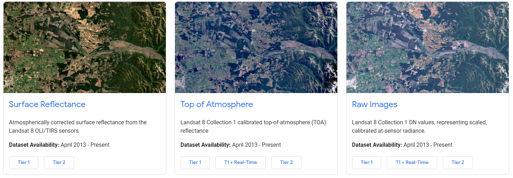

# Chapter 1 - Basics of Google Earth Engine (GEE) - Python

Google Earth Engine (GEE) is a platform for scientific analysis and visualization of geospatial datasets, for academic, non-profit, business and government users. There are lots of satellite data and geo spatial data gathered every day. Those data are not used by many people due to large size and complicated nature of satellite data. GEE provides online platform that can be used to access, visualize, analyze those data within google cloud.

Some of important links related to GEE.
- GEE Time lapse - https://earthengine.google.com/timelapse/
- GEE Data Catalog - https://developers.google.com/earth-engine/datasets
- GEE Code Editor (only for Javascript) - https://code.earthengine.google.com/
- GEE Documentation (Guides) - https://developers.google.com/earth-engine/guides
- GEE Documentation (API docs) - https://developers.google.com/earth-engine/apidocs

__Content__

* (1) Google Earth Engine Initial Set-up
* (2) Getting Started with GEE Images
* (3) Mathematical Operations on Images
* (4) Exporting GEE Images
  * (4.1) Export as Numpy array
  * (4.2) Export as GeoTiFF file
* (5) Working with Image Collections is GEE
  * (5.1) Defining Image Collection
  * (5.2) Reducing an ImageCollection
  * (5.3) Additional Stuff (Mosaicking and Mapping)
* (6) Vector Data and Charts in GEE

## 1) Google Earth Engine Initial Set-up

In this exercise, we will use a python library call "geemap" to visualize GEE data in a map. Let's first install "geemap" library, using "pip" Python package-management system.

```python
!pip install geemap
```

__Note__ In Jupyter Notebooks we can use "!" to run DOS/Shell commands.

First, let's try to import libraries that we are going to use in this session

```python
import numpy as np
import matplotlib.pyplot as plt
import pandas as pd

import ee
import geemap
```

Then, let's try to Authentication and Initialization GEE.

```python
ee.Authenticate()
ee.Initialize()
```

Follow steps in following diagram to get access to GEE through Google Colab.


## 2) Getting Started with GEE Images

All the data in GEE can be searched in Earth Engine Data Catalog. In this case, let's try to access SRTM DEM data. Go to the https://developers.google.com/earth-engine/datasets/catalog and search for "SRTM" key word. Then go to "SRTM Digital Elevation Data Version 4" link. Here we can see metadata about dataset, sample code to access data and so on. Most important thing here is "Earth Engine Snippet". It gives code to access dataset from either Python or Javascript programing languages.

__Note__ (Little bit information about SRTM): SRTM is Free Global Digital Elevation Models in 30m Spatial Resolution. The SRTM was produced from 11-day mission of the Space Shuttle Endeavour in February 2000 with modified radar system. You can download SRTM Data from http://srtm.csi.cgiar.org/srtmdata/

Now let's try to get SRTM elevation data from GEE visualize it in our notebook using "geemap" library

```python
dem = ee.Image('CGIAR/SRTM90_V4')
elevation = dem.select('elevation')
```

__Note__: We can use *elevation.getInfo()* to print data included in any GEE variable

We can use following code snippet to visualize data in a map using "geemap" library. First we define our map parameters such as centered location, zoom level, etc. And then we can define map visualization parameters. Finally we can add the image layer to the map and display it.

```python
# Define a map centered on Thailand, zoom level, etc.
Map = geemap.Map(center = [15.8700,100.9925], zoom = 6)

# Let's define map visualization parameters
vis_Para = {'min': 0, 'max': 2585}

# Add the image layer to the map and display it.
Map.addLayer(elevation, vis_Para, name="DEM")
Map
```

Similarly we can add more colors to map visualization parameters to have a more meaningful visualization.

```python
Map = geemap.Map(center = [15.8700,100.9925], zoom = 6)
vis_Para = {'min': 0, 'max': 2585, 'palette': ['brown', 'green']}

Map.addLayer(elevation, vis_Para, name="DEM")
Map
```

__Exercise__: Play around visualization parameters to display data in different ways

Now let's try to visualize RGB image from Landsat 8 collection (https://developers.google.com/earth-engine/datasets/catalog/LANDSAT_LC08_C02_T1_L2). In Landsat 8,
- Band 2 -> Blue
- band 3 -> Green
- Band 4 -> Red
- Band 5 -> NIR

There are many Landsat 8 data types in GEE. Here we are using atmospherically corrected surface reflectance data which is well processed and ready-to-use dataset. And following image shows, difference between images with different levels of preprocessing.



```python
LS8_img = ee.Image('LANDSAT/LC08/C02/T1_L2/LC08_127051_20200120')

Map = geemap.Map(center = [12.9674,104.0529], zoom = 8)
vis_Para = {'min': 0, 'max': 30000, 'bands': ['SR_B4', 'SR_B3', 'SR_B2']}
Map.addLayer(LS8_img, vis_Para, name="Exaple LANDSAT Image")
Map
```

__Exercise__: Now try to visualize false color composite for Infrared (vegetation) ->	B5, B4, B3 (Reference: https://www.esri.com/arcgis-blog/products/product/imagery/band-combinations-for-landsat-8/)

## 3) Mathematical Operations on Images

We can use simple mathematical operations on images by simply calling common mathematical function provided by GEE API. Here let's use "Greater Than" operation to classify elevation data in to 2 classes (class 1: > 1000m, class 2: <=1000m).

```python
dem = ee.Image('CGIAR/SRTM90_V4')
elevation = dem.select('elevation')

elevationMask = elevation.gt(1000)
```

And then visualize results

```python
Map = geemap.Map(center = [15.8700,100.9925], zoom = 6)
vis_Para = {'min': 0, 'max': 1, 'palette': ['brown', 'green']}
Map.addLayer(elevationMask, vis_Para, name="DEM Mask")
Map
```

Some other commonly used mathematical operations on images are listed below, (more info: https://developers.google.com/earth-engine/apidocs/ee-image)
- *image1.add(image2)* -> Addition between 2 images or image with a constant
- *image1.subtract(image2)* -> Subtraction between 2 images or image with a constant
- *image1.divide(image2)* -> Division between 2 images or image with a constant
- *image1.multiply(image2)* -> Multiplication between 2 images or image with a constant
- *image1.pow(image2)* ->  Power between 2 images or image with a constant
- *image1.lt(image2)* -> Less than operation between 2 images or image with a constant
- *image1.lte(image2)* -> Less than or equal between 2 images or image with a constant
- *image1.gt(image2)* ->  Greater than between 2 images or image with a constant
- *image1.gte(image2)* -> Greater than or equal between 2 images or image with a constant

__Exercise__: Convert SRTM elevation data to KM from Meters and visualize it.

Now let's use these simple mathematical operations to perform meaningful task like water extraction from Landsat 8 satellite image using below code.

Usually water absorb NIR energy. So, NIR band has the largest difference in reflectance values between water and non-water bodies. Hence NIR is frequently use to extract water from Satellite Images.

```python
LS8_img = ee.Image('LANDSAT/LC08/C02/T1_L2/LC08_127051_20200120')
LS8_nir = LS8_img.select('SR_B5')

LS8_water = LS8_nir.lt(12500)

Map = geemap.Map(center = [12.9674,104.0529], zoom = 8)
vis_Para = {'min': 0, 'max': 1, 'palette': ['white', 'blue']}
Map.addLayer(LS8_water, vis_Para, name="Tonlesap Lake - Water Mask")
Map
```

__Exercise__: Play around with threshold to find out best threshold that separate water and land classes

Simple image math can be performed using above operators like add() and subtract(). But for complex computations with more than a couple of terms, the *expression()* function is a good alternative. To implement more complex mathematical expressions, consider using *image.expression()*, which parses a text representation of a math operation. As a simple example, consider the task of calculating the Normalized Difference Vegetation Index (NDVI) using Landsat imagery

```python
LS8_img = ee.Image('LANDSAT/LC08/C02/T1_L2/LC08_127051_20200120')

ndvi = LS8_img.expression('(NIR-RED)/(NIR+RED)', {'NIR': LS8_img.select('SR_B5'), 'RED': LS8_img.select('SR_B4')})

Map = geemap.Map(center = [12.9674,104.0529], zoom = 8)
vis_Para = {'min': 0, 'max': 1, 'palette': ['yellow', 'green']}
Map.addLayer(ndvi, vis_Para, name="Tonlesap Lake - NDVI")
Map
```

__Exercise__: Apply threshold on NDVI image to separate high vegetation area and low vegetation area and visualize it.

__Exercise__: Similarly try to calculate another advance vegetation index knows as Enhanced Vegetation Index (EVI) using below ,equation
- *2.5 x ((NIR - RED) / (NIR + 6 x RED - 7.5 x BLUE + 1))*

Similarly we can perform these mathematical operations between 2 images too

Let's calculate difference between NDVI values of "5-year Landsat 7 composite 2008-2012" (*ee.Image('LANDSAT/LE7_TOA_5YEAR/2008_2012')*) and "5-year Landsat 7 composite 1999-2003" (*ee.Image('LANDSAT/LE7_TOA_5YEAR/1999_2003')*). By visualizing these NDVI difference images, we can see global change of NDVI (possibly changes in forest cover) between 2008_2012 period and 1999_2003 period.

```python
ls1999 = ee.Image('LANDSAT/LE7_TOA_5YEAR/1999_2003')
ls2008 = ee.Image('LANDSAT/LE7_TOA_5YEAR/2008_2012')

ls1999_ndvi = ls1999.expression('(NIR-RED)/(NIR+RED)', {'NIR': ls1999.select('B4'), 'RED': ls1999.select('B3')})
ls2008_ndvi = ls2008.expression('(NIR-RED)/(NIR+RED)', {'NIR': ls2008.select('B4'), 'RED': ls2008.select('B3')})

diff = ls2008_ndvi.subtract(ls1999_ndvi)

Map = geemap.Map(center = [15.8700,100.9925], zoom = 6)
vis_Para = {'min': 0, 'max': 0.5, 'palette': ['brown', 'green']}
Map.addLayer(diff, vis_Para, name="NDVI Diff 2008 - 1999")
Map
```

__Exercise__: Edit above code to calculate square of NDVI difference and visualize it.

## 4) Exporting GEE Images

There is mainly 2 ways that, we can export images from GEE, as below
- Export as Numpy array
- Export as GeoTiFF file

### 4.1) Export as Numpy array

Here, we can export a region of an image as Numpy array and, we can do any analysis on exported image using any Python libraries like Numpy, etc.

Let's try to export SRTM elevation data around Mount Everest as a Numpy array

```python
dem = ee.Image('CGIAR/SRTM90_V4')

# Define study area (AOI) around Mount Everest as a rectangle
aoi = ee.Geometry.Rectangle([86.90, 27.90, 87.10, 28.10])

# Get array by massing by AOI
band_arrs = dem.sampleRectangle(region=aoi)
```

Now we can use any python function for further analysis or visualize with Python library like matplotlib

```python
dem_everest = np.array( band_arrs.get('elevation').getInfo() )

plt.imshow(dem_everest)
plt.show()
```

__Note__ Similar to *dem.sampleRectangle(region=aoi)*, we can use clipping operation with study area as well, as example:

```python
elevation_clip = elevation.clip(aoi)
```

### 4.2) Export as GeoTiFF file

Here, we can directly export GeoTIFF image with all coordinate / projection information into Google Drive.

```python
dem = ee.Image('CGIAR/SRTM90_V4')
elevation = dem.select('elevation')

task = ee.batch.Export.image(elevation, 'dem_everest', {'region': aoi, 'scale': 30})
task.start()
```

Then you can go to Google Drive and see the exported GeoTIFF file. And you can open that in any GIS software such as ArcGIS, QGIS, etc.

__Note__ We can save GeoTIFF file to Google Drive using "geemap" library as below,

```python
geemap.ee_export_image_to_drive(elevation, description='dem_everest', scale = 100, region=aoi)
```

__Note__ We can save GeoTIFF file to session storage using "geemap" library as below,

```python
geemap.ee_export_image(elevation, filename='/content/dem_everest.tif', scale = 100, region=aoi)
```

## 5) Working with ImageCollections is GEE

In most cases, we have to work with set of images rather than a single image. As an example, images from a satellite, time series climate data, etc. are available as set of images. These are referred as ImageCollection in GEE. simply, ImageCollection is a stack or time series of images.

An ImageCollection can be loaded by passing an Earth Engine asset ID into the *ImageCollection* class. You can find *ImageCollection IDs* in the data catalog.

### 5.1) Defining Image Collection

First let’s try with ImageCollection of famous satellite called Landsat 8 (Location: Tonlé Sap lake in Cambodia). Additionally, we will filter the ImageCollection by location, date and sort by cloud coverage.

*__Note__ (Little bit information about Landsat 8): The Landsat program is the longest-running satellite imagery acquisition program of Earth starting from July 23, 1972. Landsat 8 is the most recent Satellite in the series launched on 11 February 2013. Spatial resolution is 30m and revisit time is 16 Days. You can download original Data from *http://earthexplorer.usgs.gov/*

```python
aoi = ee.Geometry.Rectangle(103.66, 12.39, 104.64, 13.28)

lst8Col = ee.ImageCollection('LANDSAT/LC08/C02/T1_L2').filterDate('2018-09-01', '2018-10-31').filterBounds(aoi)
lst8Col = lst8Col.sort('CLOUD_COVER')

# get number of images in Image Collection
print(lst8Col.size().getInfo())

# get meta-data about image collection
print(lst8Col.getInfo())
```

Now let's get first image in the ImageCollection and visualize it.

```python
lst8Col_1 = lst8Col.first()

Map = geemap.Map(center = [12.9674,104.0529], zoom = 8)
vis_Para = {'min': 0, 'max': 20000, 'bands': ['SR_B4', 'SR_B3', 'SR_B2']}
Map.addLayer(lst8Col_1, vis_Para, name="LS8_Tonle_Sap")
Map
```

Now let's try to visualize an layer with Near Infrared (NIR) band of same image which is suitable to distinguishing water and land, as well as sensitive to vegetation content.

```python
lst8Col_1_nir = lst8Col.first().select('SR_B5')

Map = geemap.Map(center = [12.9674,104.0529], zoom = 8)
vis_Para = {'min': 0, 'max': 20000}
Map.addLayer(lst8Col_1_nir, vis_Para, name="LS8_Tonle_Sap")
Map
```

If we want to get particular image in the ImageCollection, we can use below code snippet. As example, let's try to get 5th image

```python
lst8Col_5 =  ee.Image(lst8Col.toList(11).get(5))
```

__Exercise:__ Try more False Color Composites (specially 7-5-3 band) of the 5th image in same ImageCollection, emphasizing more on different land cover types. For more information about False Color Composites, please refer to https://www.harrisgeospatial.com/Learn/Blogs/Blog-Details/ArtMID/10198/ArticleID/15691/The-Many-Band-Combinations-of-Landsat-8

### 5.2) Reducing an ImageCollection

To composite images in an Image Collection, we use Reducing operation. This will composite all the images in an ImageCollection to a single image. This reduction can be performed based on simple time series statistical operations such as min, max, mean, medium or standard deviation of all images in the ImageCollection. In some references, this is called as cell statistics. And it’s powerful technique that can be used to reduce set of images to a single image. This operation is shown in the below figure


As an example, since water pixels are dark pixels (less pixel value), by getting time series minimum, we will get maximum water extent of a water body. Since cloud pixels are bright (high pixel values), time series minimum operation will also remove cloud pixels as well.

Now, let’s use reduction over ImageCollection to get maximum water extent of the lake and visualize NIR band that separate water extent well.

```python
aoi = ee.Geometry.Rectangle(103.66, 12.39, 104.64, 13.28)
lst8Col = ee.ImageCollection('LANDSAT/LC08/C02/T1_L2').filterDate('2018-09-01', '2018-10-31').filterBounds(aoi)
lst8Col = lst8Col.sort('CLOUD_COVER')

lst8Col_min = lst8Col.min()
lst8Col_min_nir = lst8Col_min.select('SR_B5')

Map = geemap.Map(center = [12.9674,104.0529], zoom = 8)
vis_Para = {'min': 0, 'max': 20000}
Map.addLayer(lst8Col_min_nir, vis_Para, name="LS8_Tonle_Sap")
Map
```

__Exercise:__ Try to visualize RGB image of minimum-reduced image.

__Exercise__: As we did early, use simple threshold to detect flood water from Near Infrared (NIR) Band from minimum-reduced image.

__Exercise__: As we do early, calculate NDVI and EVI from the minimum-reduced image.

### 5.3) Additional Stuff (Mosaicking and Mapping)

Here, let's learn about additional 2 operations with ImageCollection
- Mosaicking
- Mapping over ImageCollection

Mosaicking refers to the process of spatially assembling images to produce a spatially continuous image.

```python
aoi = ee.Geometry.Rectangle(103.66, 12.39, 104.64, 13.28)
lst8Col = ee.ImageCollection('LANDSAT/LC08/C02/T1_L2').filterDate('2018-09-01', '2018-10-31').filterBounds(aoi)
lst8Col = lst8Col.sort('CLOUD_COVER')

lst8Col_mosaic = lst8Col.mosaic()

lst8Col_mosaic_nir = lst8Col_mosaic.select('SR_B5')

Map = geemap.Map(center = [12.9674,104.0529], zoom = 8)
vis_Para = {'min': 0, 'max': 20000}
Map.addLayer(lst8Col_mosaic_nir, vis_Para, name="LS8_Tonle_Sap")
Map
```

Mapping can be used to perform a mathematical operation over all images in an ImageCollection. As example, if we want to calculate flood in all images of a ImageCollection, we can use mapping operation as below,

```python
aoi = ee.Geometry.Rectangle(103.66, 12.39, 104.64, 13.28)
lst8Col = ee.ImageCollection('LANDSAT/LC08/C02/T1_L2').filterDate('2018-09-01', '2018-10-31').filterBounds(aoi)
lst8Col = lst8Col.sort('CLOUD_COVER')

def waterDetection(image):
  return image.select('SR_B5').lt(10000)

lst8Col_water = lst8Col.map(waterDetection)

lst8Col_water_1 = lst8Col_water.first().select('SR_B5')

Map = geemap.Map(center = [12.9674,104.0529], zoom = 8)
vis_Para = {'min': 0, 'max': 1}
Map.addLayer(lst8Col_water_1, vis_Para, name="LS8_Tonle_Sap")
Map
```

__Exercise:__ Calculate NDVI and EVI of all images in the same ImageCollection using mapping operation, and then, visualize NDVI and EVI values of 5th image of the ImageCollection.

## 6) Vector Data and Charts in GEE

Here let's try to summarize population in different parts of Thailand. Here we will use gridded population data from GEE (https://developers.google.com/earth-engine/datasets/catalog/CIESIN_GPWv411_GPW_UNWPP-Adjusted_Population_Count) and administrative boundary vector data (https://developers.google.com/earth-engine/datasets/catalog/FAO_GAUL_2015_level2) from GEE.

First let's try to load and visualize gridded population data.

```python
dataset = ee.ImageCollection("CIESIN/GPWv411/GPW_UNWPP-Adjusted_Population_Count").first()

population = dataset.select('unwpp-adjusted_population_count')

Map = geemap.Map(center = [15.8700,100.9925], zoom = 6)
vis_Para = {'min': 0, 'max': 500, 'palette': ['brown', 'green']}
Map.addLayer(population, vis_Para, name="Population")
Map
```

Now let's load our administrative dataset and filter features in Thailand.

```python
admin_l1 = ee.FeatureCollection("FAO/GAUL/2015/level1")

admin_th = admin_l1.filter(ee.Filter.eq('ADM0_NAME', 'Thailand'))
```

__Note__: You visualize vector layer as well using *Map.addLayer(admin_th, {}, name="Thailand")*

Now let's try to calculate zonal statistics by summing the population in each admin unit. In GEE context this process is known as reducing regions, as shown in below figure.


```python
popByProvince = population.reduceRegions(admin_th, ee.Reducer.sum(), 1000)
```

And now let's try to plot these population values in a bar chart using matplotlib library.

```python
admin1_name = popByProvince.aggregate_array('ADM1_NAME').getInfo()
pop_in_admin1 = popByProvince.aggregate_array('sum').getInfo()

plt.figure(figsize=(20,10))
plt.bar(admin1_name, pop_in_admin1)
plt.xticks(admin1_name, rotation='vertical')
plt.show()
```

__Note:__ There is a dedicated GEE class for charts, call *ui.Chart*. But it is only available in the Earth Engine Code Editor (for Javascript)
