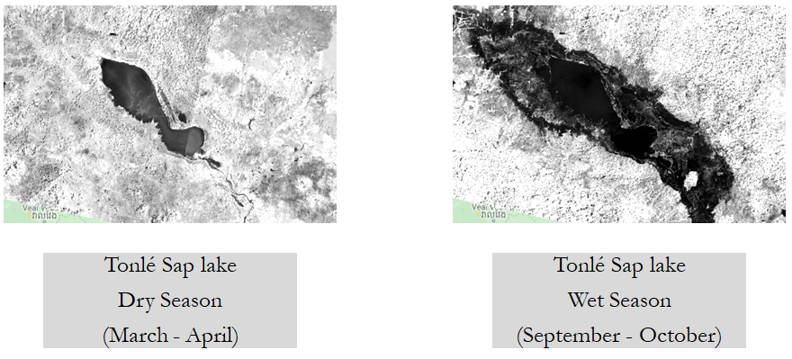
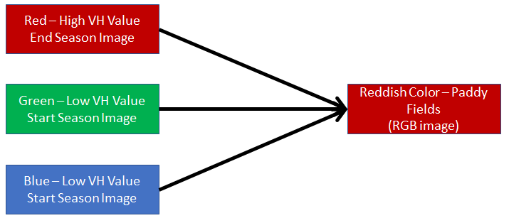
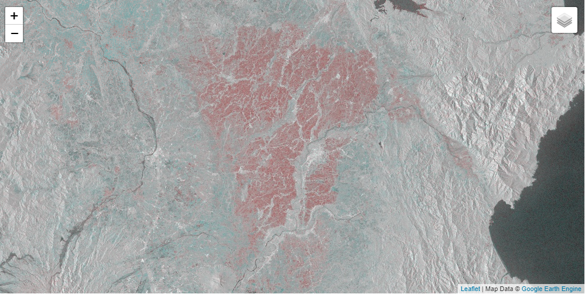

# Case Studies (Applications) of Google Earth Engine (GEE)

Here, we will do some case studies using concepts that we have learned in previous sections. Following case studies will be covered during this session.

__Content__

- (1) Mapping Surface Water Dynamics
- (2) Mapping Agricultural Area
- (3) Mapping Drought Area

Before start, let's perform GEE Authenticate, Initialize, and importing libraries.

```python
import numpy as np
import matplotlib.pyplot as plt
import pandas as pd

import ee
import geemap

ee.Authenticate()
ee.Initialize()
```

## 1) Mapping Surface Water Dynamics

In this section, we will do a flood mapping case study in Tonlé Sap lake in Cambodia. We will use Landsat 8  images in wet and dry seasons to see the change of water extent of the lake, as shown in below Figure. And meanwhile we will learn more concepts, tools in GEE.



Let's assume, wet and dry seasons of Cambodia are as follows,
- Dry Season - '2018-03-01','2018-04-30'
- Wet Season - '2018-09-01' to '2018-10-30'

Let’s first define an image collection for dry season in Cambodia and perform following steps,

- reduce collection by minimum operations
- select NIR bands
- apply threshold to get the water area
- visualize the water area

```python
studyArea = ee.Geometry.Rectangle(103.66, 12.39, 104.64, 13.28);
drySeason = ee.ImageCollection('LANDSAT/LC08/C02/T1_L2').filterDate('2018-03-01','2018-04-30').filterBounds(studyArea)

drySeasonMin = drySeason.min()
drySeasonNIR = drySeasonMin.select('SR_B5')
drySeasonWater = drySeasonNIR.lt(11000)

Map = geemap.Map(center = [12.9674,104.0529], zoom = 8)
vis_Para = {'min': 0, 'max': 1}
Map.addLayer(drySeasonWater, vis_Para, name="Dry Season")
Map
```

__Note:__ Since wet and dry both image collections contains many images, we can use some time series analysis to reduce image collection to an one image. Since water pixels are the dark pixels (less pixel value), if we perform time series minimum, we will get maximum water extent in a time period. In some references, this is called as cell statistics. And it’s powerful technique that can be used to reduce set of images into a single image. As a byproduct of this process, we are removing clouds (brighter pixels) in the images as well.

Now let's try to do same steps for wet season too.

```python
studyArea = ee.Geometry.Rectangle(103.66, 12.39, 104.64, 13.28);
wetSeason = ee.ImageCollection('LANDSAT/LC08/C02/T1_L2').filterDate('2018-09-01','2018-10-30').filterBounds(studyArea)

wetSeasonMin = wetSeason.min()
wetSeasonNIR = wetSeasonMin.select('SR_B5')
wetSeasonWater = wetSeasonNIR.lt(11000)

Map = geemap.Map(center = [12.9674,104.0529], zoom = 8)
vis_Para = {'min': 0, 'max': 1}
Map.addLayer(wetSeasonWater, vis_Para, name="Wet Season")
Map
```

Flood water in wet season are the water, which was absent in the dry season and present in the wet season. This can be extracted using Boolean math operation (*flooosWater = wetSeasonWater.eq(1).And(drySeasonWater.eq(0))*) or simply subtracting wet season water extent by dry season water extent as below,

```python
floodWater = wetSeasonWater.subtract(drySeasonWater)

Map = geemap.Map(center = [12.9674,104.0529], zoom = 8)
vis_Para = {'min': 0, 'max': 1}
Map.addLayer(floodWater, vis_Para, name="Flood Water")
Map
```

Furthermore we can use post-processing step call focal filtering to smooth out unwanted small noise in flood image as below,


```python
floodWaterFilt = floodWater.focal_mode(2)
```

__*Finally let’s bring all together in to a one code*__

```python
studyArea = ee.Geometry.Rectangle(103.66, 12.39, 104.64, 13.28)

# for dry season
drySeason = ee.ImageCollection('LANDSAT/LC08/C02/T1_L2').filterDate('2018-03-01','2018-04-30').filterBounds(studyArea)
drySeasonMin = drySeason.min()
drySeasonNIR = drySeasonMin.select('SR_B5')
drySeasonWater = drySeasonNIR.lt(11000)

# for wet season
wetSeason = ee.ImageCollection('LANDSAT/LC08/C02/T1_L2').filterDate('2018-09-01','2018-10-30').filterBounds(studyArea)
wetSeasonMin = wetSeason.min()
wetSeasonNIR = wetSeasonMin.select('SR_B5')
wetSeasonWater = wetSeasonNIR.lt(11000)

# subtracting to create flood map
floodWater = wetSeasonWater.subtract(drySeasonWater)

# filtering to remove noise
floodWaterFilt = floodWater.focal_mode(2)

# visualize the final result
Map = geemap.Map(center = [12.9674,104.0529], zoom = 8)
vis_Para = {'min': 0, 'max': 1}
Map.addLayer(floodWaterFilt, vis_Para, name="Flood Water")
Map
```

__Exercise:__ Use output of above case study to calculate province wise flooded area and plot province-wise flooded area as a bar chart.

And answer is as below. You can try to do by yourself first and compare your answer with below code.

```python
admin_l2 = ee.FeatureCollection("FAO/GAUL/2015/level2")
admin_cam = admin_l2.filter(ee.Filter.eq('ADM0_NAME', 'Cambodia'))

flood_sum = floodWaterFilt.reduceRegions(admin_cam, ee.Reducer.sum(), 1000)

admin1_name = flood_sum.aggregate_array('ADM1_NAME').getInfo()
flood_in_admin1 = flood_sum.aggregate_array('sum').getInfo()
plt.figure(figsize=(20,10))
plt.bar(admin1_name, flood_in_admin1)
plt.xticks(admin1_name, rotation='vertical')
plt.show()
```

__Exercise:__ Similarly use a population layer in GEE and calculate province wise population under flooded area and plot it as a bar chart as well.

## 2) Mapping Agricultural Area

In this case study, we will use satellite images to map paddy area of an irrigation scheme in a Nueva Ecija province of Philippines. We will use same ideas that we used in our last GEE sessions, as well as couple of new ideas in GEE.

Find and get 2 Sentinel-1 (COPERNICUS/S1_GRD) images acquired in following days

- Start of the season - '2019-01-15' to '2019-01-20'
- End of the season - '2019-03-28' to '2019-03-31'

And our study area is,

- Left Longitude - 120.77
- Bottom Latitude - 15.43
- Right Longitude - 121.13
- Top Latitude - 15.72

Here we are using microwave satellite data from a satellite call Sentinel-1. The microwave satellite data penetrate through cloud and also doesn't depend on sun light. Hence they can use for all day, all weather observations. So it can be used in rainy season as well. But the disadvantage here is difficulty of interpretation of microwave satellite data.

The Sentinel-1 mission provides data from a dual-polarization C-band Synthetic Aperture Radar (SAR) instrument. This collection includes the S1 Ground Range Detected (GRD) scenes, processed using the Sentinel-1 Toolbox to generate a calibrated, ortho-corrected product. The collection is updated daily. New assets are ingested to GEE within two days after they become available.

Similar to NIR data, water appears dark in microwave satellite data. This property of microwave satellite data, as well as all weather observation capabilities are frequently used in flood mapping, rice mapping with flooding in paddy-fields, etc.

In this case of paddy fields, microwave satellite looks dark at the beginning of paddy season due to flooding in paddy-fields. And they look brighter before harvesting, because of grown up paddy plants in fields. We are going to use this property in this case study to map paddy areas.

First let's define our image collections of Sentinel-1 images in start and end of the season

```python
studyArea = ee.Geometry.Rectangle(120.77, 15.43, 121.13, 15.72)

startSeason = ee.ImageCollection('COPERNICUS/S1_GRD').filterDate('2019-01-15','2019-01-20').filterBounds(studyArea)
endSeason = ee.ImageCollection('COPERNICUS/S1_GRD').filterDate('2019-03-28','2019-03-31').filterBounds(studyArea)

print(startSeason.size().getInfo())
print(endSeason.size().getInfo())
```

We can see, we have only one image in both image collections. So let's choose that, select the VH band and go ahead.

```python
startSeasonImg = startSeason.first()
endSeasonImg = endSeason.first()

startSeasonVH = startSeasonImg.select(['VH'], ['VH_start'])
endSeasonVH = endSeasonImg.select(['VH'], ['VH_end'])
```

If we visualize our images at the start and the end of the season, we can see that, the start of the season paddy areas are in dark color, because of the availability of water in paddy fields. And at the end of the season, paddy areas are in brighter color, because of grown up paddy plants in fields. We can use false color composite concept that we have learned early to visualize this property (paddy-fields). Graphical representation of this idea is shown in in below figure,



So first, let's define another image stacking these 2 images (*startSeasonVH* and *endSeasonVH*) as bands and visualize the false color composite image, as below,
- Red band - *endSeasonVH*
- Green band - *startSeasonVH*
- Blue band - *startSeasonVH*

```python
imageFCC = ee.Image([startSeasonVH, endSeasonVH])

Map = geemap.Map(center = [15.55,120.95], zoom = 8)
vis_Para = {'min': -50, 'max': 1, 'bands': ['VH_end', 'VH_start', 'VH_start']}
Map.addLayer(imageFCC, vis_Para, name="Paddy Area")
Map
```

Results of FCC should look like below. And paddy area is shown in red color



__Exercise:__ Similar to case study 1, try to extract paddy area using subtraction and thresholding operations

## 3) Mapping Drought Area

Here we are trying to map drought affected areas in the Cambodia. There was a known drought in 2010 in the Cambodia and surrounding countries. This drought event was occurred between 3 months period from 2010-April to 2010-June. So let's try to map drought extent in each month, and then try to map drought duration in months (map showing number of months each location/pixel is under drought).

In the remote sensing context, droughts are assesses by drought indexes derived from satellite meteorological data. They are specifically designed to assess meteorological drought. Keetch-Byram Drought Index (KBDI) is one such drought index which calculates based on satellite-derived rainfall and temperature data. It reflects water gain or loss within the soil. KBDI is also widely used for drought monitoring for national weather forecast, wildfire prevention. And this is especially usefully in regions with rain-fed crops. The values of KBDI ranges from 0 (no moisture deficit) to 800 (extreme drought). This dataset is a product of a research team from a University of Tokyo (http://wtlab.iis.u-tokyo.ac.jp/en/research_e.html). And this dataset is currently available in GEE (https://developers.google.com/earth-engine/datasets/catalog/UTOKYO_WTLAB_KBDI_v1).

Here we will perform following steps

- We calculate mean KBDI values for each month (April, May and June) in 2010
- We calculate KBDI baseline for averaging all images in each month (April, May and June). This provide our baseline values. This means, results of this calculation represents as normal monthly KBDI values.
- Then, we can calculate KBDI anomaly values by subtracting KBDI baseline values from KBDI values of each month. As example, in month of April -> *[KBDI Anomaly in April, 2010] = [KBDI Value in April, 2010] - [KBDI Baseline Value in April]*
- According to literature, if the KBDI Anomaly is higher than 300, that area is considered as drought area. So, we can use this simple threshold to extract drought areas in each month.
- We can do the same process for April, May and June months in 2010, and we can add all of them to get drought duration map. After that, we can clip into the Cambodia's country boundary and visualize it.

__Note:__ we can use *ee.Filter.calendarRange([start_month], [end_month],'month')* to filter ImageCollection just only based on month.

```python
# for April month
kbdi4 = ee.ImageCollection('UTOKYO/WTLAB/KBDI/v1').filter(ee.Filter.date('2010-04-01','2010-04-30')).mean()
kbdi4_baseline = ee.ImageCollection('UTOKYO/WTLAB/KBDI/v1').filter(ee.Filter.calendarRange(4,4,'month')).mean()
kbdi4_anm = kbdi4.subtract(kbdi4_baseline)
drought4 = kbdi4_anm.gt(300)

# for May month
kbdi5 = ee.ImageCollection('UTOKYO/WTLAB/KBDI/v1').filter(ee.Filter.date('2010-05-01','2010-05-30')).mean()
kbdi5_baseline = ee.ImageCollection('UTOKYO/WTLAB/KBDI/v1').filter(ee.Filter.calendarRange(5,5,'month')).mean()
kbdi5_anm = kbdi5.subtract(kbdi5_baseline)
drought5 = kbdi5_anm.gt(300)

# for June month
kbdi6 = ee.ImageCollection('UTOKYO/WTLAB/KBDI/v1').filter(ee.Filter.date('2010-06-01','2010-06-30')).mean()
kbdi6_baseline = ee.ImageCollection('UTOKYO/WTLAB/KBDI/v1').filter(ee.Filter.calendarRange(6,6,'month')).mean()
kbdi6_anm = kbdi6.subtract(kbdi6_baseline)
drought6 = kbdi6_anm.gt(300)

# generating drought duration map
drought_duration = drought4.add(drought5).add(drought6)

# clipping to the Cambodia's country boundary
aoi = ee.Geometry.Rectangle(102.3, 9.9, 107.7, 14.7)
drought_duration = drought_duration.clip(aoi)

# visualizing drought duration map
Map = geemap.Map(center = [12.5,104.5], zoom = 8)
vis_Para = {'min': 0, 'max': 3, 'palette':['yellow', 'brown']}
Map.addLayer(drought_duration, vis_Para, name='Drought Duration')
Map
```
