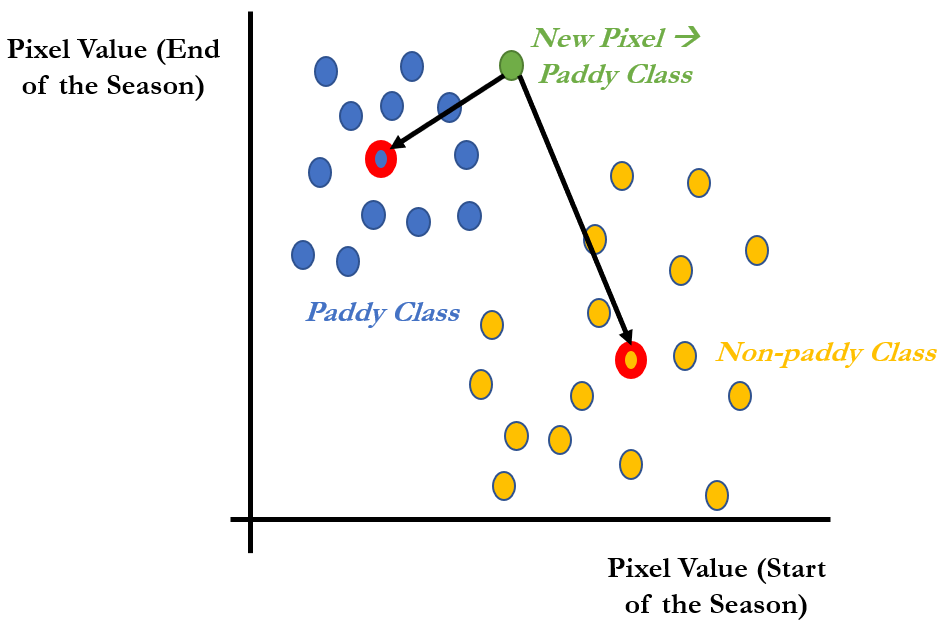
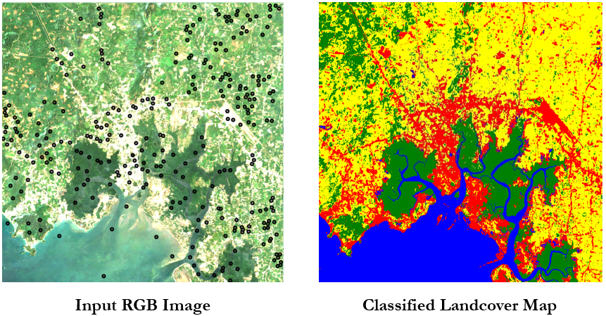

# Chapter 3 - Image Supervised and Unsupervised Classification with GEE

__Content__

* (1) Supervised Classification
* (2) Accuracy Assessment
* (3) Unsupervised Classification (Clustering)

First, let's authenticate, initialize, and import libraries to GEE as usual

```python
import numpy as np
import matplotlib.pyplot as plt
import pandas as pd

import ee
import geemap

ee.Authenticate()
ee.Initialize()
```

## 1) Supervised Classification

Let's consider our past case study of mapping paddy fields in the Philippines. In that case study, we have used thresholding to sperate paddy and non-paddy classes. And these thresholds were estimated just by experimentation or guessing. More formal way of doing it, is first we mark example paddy and non-paddy points/areas in the image. Then we can ask a computer algorithm to figure out appropriate thresholds or method to separate paddy and non-paddy areas. This is the main idea of machine learning (Supervised). Furthermore, machine learning (Supervised) simply means learning patters in data through examples. In the context of Remote Sensing (Satellite Image Analysis), we call this as Image Classification (Supervised).

First lets export our time series 2 band false color composite (FCC) image that we have created in the past paddy mapping case study.

```python
studyArea = ee.Geometry.Rectangle(120.77-0.15, 15.43-0.2, 121.13+0.07, 15.72+0.1)

startSeason = ee.ImageCollection('COPERNICUS/S1_GRD').filterDate('2019-01-15','2019-01-20').filterBounds(studyArea)
endSeason = ee.ImageCollection('COPERNICUS/S1_GRD').filterDate('2019-03-28','2019-03-31').filterBounds(studyArea)

startSeasonVH = startSeason.first().select(['VH'], ['VH_start'])
endSeasonVH = endSeason.first().select(['VH'], ['VH_end'])

imageFCC = ee.Image([startSeasonVH, endSeasonVH]).clip(studyArea)

geemap.ee_export_image(imageFCC, filename='/content/phip_paddy_fcc.tif', scale = 100, region=studyArea)
```

Then, import exported image to QGIS, and follow following steps,

- 1) Create new Point Shapefile (*gt_paddy.shp*)
- 2) Add around 10-20 points (with *ID* of *1*) in paddy areas, and around 10-20 points in non-paddy areas (with *ID* of *0*) to *gt_paddy.shp* Shapefile.
- 3) Save changes
- 4) Upload *gt_paddy.shp* (with *.prj*, *.dbf*, and *.shx*) Shapefile to GEE's Session Storage

And import the uploaded Shapefile to GEE using *geemap* library. After than, we can extract pixel values of FCC image at example points in *gt_paddy.shp* Shapefile, as below.

```python
gt_paddy = geemap.shp_to_ee('/content/gt_paddy.shp')
example_pnts = imageFCC.sampleRegions(gt_paddy, scale=30)
```

Then we can use a Classification algorithm, provided by GEE to automatically estimate appropriate thresholds (or Classifier) to distinguish paddy and non-paddy areas as below,

```python
my_classifier = ee.Classifier.minimumDistance().train(example_pnts, 'id')
class_result = imageFCC.classify(my_classifier)

Map = geemap.Map(center = [15.525,120.91], zoom = 10)
vis_Para = {'min': 0, 'max': 1}
Map.addLayer(class_result, vis_Para, name="Paddy Area")
Map
```

__Note:__ "Minimum Distance" Classification algorithm is one of most simple and well-known classification algorithm. In this case study, this algorithm will first estimate centers in paddy and non-paddy classes in the feature space created for our example points. Then class of all other pixels in the image will be determined by minimum distance to centers of these 2 classes. As example, if a new pixel is more close to paddy class than non-paddy class, that new pixel will be assigned to paddy class, and vice-versa. This idea is presented graphically in the below figure (representing feature space),



If we are doing multi-class classification with many bands, manually selecting thresholds is a practically impossible task. In such kind of studies, we must use classification algorithms such as "Minimum Distance" Classification algorithm. Land-use / Land-cover mapping is a such kind of well-known example in the context of remote Sensing. In the following section, let's try to map landcover of a surrounding area of a city call "Krabi", located in the southern part of Thailand.

In this case study, we will use Sentinel-2 Surface Reflectance data. First, let's define image collection covering "Krabi" city in the dry season of 2020, where cloud cover is less compared to the wet season. Then we will use Medium reduction over the ImageCollection to combine all images in the ImageCollection to a single image. After that, we will clip by study area, and select Red (B4), Green (B3), Blue (B2) and NIR (B8) bands.

__Note:__ Medium reduction operation over an ImageCollection, helps getting rid of cloud, as well as cloud shadow. Try the Minimum reduction operation as well, and see the difference.

```python
studyArea = ee.Geometry.Rectangle(98.82, 7.98, 99.02, 8.18)

KrabiCol = ee.ImageCollection('COPERNICUS/S2_SR').filterDate('2020-01-01','2020-04-30').filterBounds(studyArea)

KrabiImg = KrabiCol.median().clip(studyArea).select(['B4','B3','B2', 'B8'])

Map = geemap.Map(center = [8.08,98.92], zoom = 12)
vis_Para = {'min': 0.0, 'max': 1000, 'bands':['B4','B3','B2']}
Map.addLayer(KrabiImg, vis_Para, name="Krabi RGB Image")
Map
```

For this case study, we will use ready-made ground-truth data covering around 300 example point in 4 landcover classes as below

- 1) Forest class -> (id = 1)
- 2) Urban class -> (id = 2)
- 3) Water class -> (id = 3)
- 4) Agriculture class -> (id = 4)

Now, let's upload *"lc_gt_train.shp"* (with *.prj*, *.dbf*, and *.shx*) Shapefile to GEE's Session Storage. And import the uploaded Shapefile to GEE using *geemap* library, and extract pixel values of *"KrabiImg"* image at ground-truth points in *"lc_gt_train.shp"* Shapefile, as below.

```python
lc_gt_train = geemap.shp_to_ee('/content/lc_gt_train.shp')
example_pnts = KrabiImg.sampleRegions(lc_gt_train, scale=30)
```

Then we can use a Random Forest Classification algorithm provided by GEE to train a Classifier to map landcover as below,

```python
my_classifier = ee.Classifier.smileRandomForest(numberOfTrees=100).train(example_pnts, 'id')
KrabiClassImg = KrabiImg.classify(my_classifier)

Map = geemap.Map(center = [8.08,98.92], zoom = 12)
vis_Para = {'min': 1, 'max': 4, 'palette':['green', 'red', 'blue', 'yellow']}
Map.addLayer(KrabiClassImg, vis_Para, name="Krabi - Landcover")
Map
```



__Note:__ Here we are using Random Forest Classifier which is a well known Classifier in the remote sensing community. It is better and more sophisticated than Minimum Distance Classifier, that we have used in the last section. Hence, Random Forest Classifier is more suitable for advance classifications, such as landcover mapping. The Random Forest Classifier is based on decision trees. And it used multiple decision trees to classify an image.

__Exercise:__ Try the Minimum Distance Classifier as well and compare the results with Random Forest Classifier.

__Exercise:__ Change "numberOfTrees" parameter in Random Forest Classifier and observe the effect on the results.

__Exercise:__ Rerun the classification adding more bands and compare the results.

__Exercise:__ Export final landcover map and open it in QGIS to make a nice map layout.

## 2) Accuracy Assessment

Even though classified results look good in the map. It's better to numerically determine the accuracy of our classification results. Usual this is performed with a separate ground-truth dataset (*"lc_gt_val.shp"*) which is known as validation dataset. Since our training was based on *"lc_gt_train.shp"* ground-truth dataset, our Classifier might be biased to this ground-truth dataset. So it's always better to use separate ground-truth dataset for accuracy assessment / validation.

Now, let's upload *"lc_gt_val.shp"* Shapefile (with *.prj*, *.dbf*, and *.shx*) to GEE's Session Storage. And import the uploaded Shapefile to GEE and extract pixel values of *"KrabiImg"* image at ground-truth points in *"lc_gt_val.shp"* Shapefile.

```python
lc_gt_val = geemap.shp_to_ee('/content/lc_gt_val.shp')
validation_pnts = KrabiImg.sampleRegions(lc_gt_val, scale=30)
```

Then let's classify these validation points using our trained Classifier (*"my_classifier"*) and print a sample feature from the classified validation dataset

```python
validation_class = validation_pnts.classify(my_classifier)

print(validation_class.first().getInfo())
```

*Results ->*
*{'geometry': None, 'id': '0_0', 'properties': {'B2': 252.5, 'B3': 438, 'B4': 250, 'B8': 3224.5, 'classification': 1, 'id': 1}, 'type': 'Feature'}*

Now, we can see that, original landcover class is in the *"id"* field/property and the classified landcover class is in *"classification"* field/property. Now we can generate Error Matrix based on these 2 fields using GEE's *"errorMatrix"* method. And we can print Total Accuracy and Kappa Coefficient (*optional*) from the Error Matrix. In the Error Matrix rows are corresponding to the actual classes/values, and columns are corresponding to the predicted classes/values.

```python
val_accuracy = validation_class.errorMatrix('id', 'classification')

print(val_accuracy.getInfo())
print(val_accuracy.accuracy().getInfo())
print(val_accuracy.kappa().getInfo()) # optional
```

Finally, we can see that the Total Accuracy is 94% which is pretty good. This means 94% of validation points have been correctly classified.

## 3) Unsupervised Classification (Clustering)

In above section, we have used examples to guide the classification. That process is known as Supervised Classification. Even without examples, we can perform classification. This is knows as Clustering in Machine Learning. And in the remote sensing field, this is known as Unsupervised Classification.

In Clustering / Unsupervised Classification, the classification will be performed automatically based on proximity of pixels in a feature space. If set of pixels are close together in a feature space, they will be classified as one cluster automatically.

In "k means" clustering algorithm that we are going to use in this section, we can define number of expected clusters (using *"nClusters"* parameter). So the "k means" clustering algorithm will automatically cluster *"nClusters"* clusters/groups of pixels.

This video shows how the "k means" clustering algorithm works, https://www.youtube.com/watch?v=5I3Ei69I40s . Steps in the "k means" clustering algorithm is also summarized below. First let's assume, the *"nClusters"* is K,

- Step-1) Select random K points or centroids for each expected cluster
- Step-2) Assign each data point to their closest centroid
- Step-3) Calculate centroid of newly created clusters, and place a new centroids of each K clusters
- Step-4) Repeat 2nd and 3rd steps until centroids are not changes

Let's consider our past case study of mapping paddy fields in the Philippines again. And lets create time series 2 band false color composite (FCC) image as we did before.

```python
studyArea = ee.Geometry.Rectangle(120.77-0.15, 15.43-0.2, 121.13+0.07, 15.72+0.1)

startSeason = ee.ImageCollection('COPERNICUS/S1_GRD').filterDate('2019-01-15','2019-01-20').filterBounds(studyArea)
endSeason = ee.ImageCollection('COPERNICUS/S1_GRD').filterDate('2019-03-28','2019-03-31').filterBounds(studyArea)

startSeasonVH = startSeason.first().select(['VH'], ['VH_start'])
endSeasonVH = endSeason.first().select(['VH'], ['VH_end'])

imageFCC = ee.Image([startSeasonVH, endSeasonVH]).clip(studyArea)
```

The entire image is too large to run clustering algorithm, so first let's select random 2500 pixels from FCC image as below

```python
imageFCC_sample = imageFCC.sample(numPixels=2500, scale=30)
```

Then we can run our clustering algorithm on selected 2500 pixels/samples for 5 classes (*"nClusters=5"*) as below,

```python
my_clustering = ee.Clusterer.wekaKMeans(nClusters=5).train(imageFCC_sample)
imageFCC_class = imageFCC.cluster(my_clustering)

Map = geemap.Map(center = [15.525,120.91], zoom = 10)
vis_Para = {'min': 0, 'max': 4}
Map.addLayer(imageFCC_class, vis_Para, name="Clustered - 5 Classes")
Map
```

Now we can use "Inspector" tool in the GEEMAP map's toolbox to find pixel values in each classified classes. In this case, we can see that, paddy area is classified into the "Class 4". Now we can separate only paddy area using "equals" Boolean operation as below, and visualize final map showing paddy area.

```python
paddy_area = imageFCC_class.eq(4)

Map = geemap.Map(center = [15.525,120.91], zoom = 10)
vis_Para = {'min': 0, 'max': 1}
Map.addLayer(paddy_area, vis_Para, name="Paddy Map")
Map
```

__Exercise:__ Change *"nClusters=5"* parameter in "k means" clustering algorithm and compare the results.

__Exercise:__ Use "k means" clustering algorithm on *"KrabiImg"* (covering Krabi city) that we have used before, to classify landcover (Forest, Urban, Water and Agriculture) and calculate the total accuracy.
- *Hint:* try to cluster into many classes (> 4 classes) first and then merge classes by looking at RGB image to produce 4 class (Forest, Urban, Water and Agriculture) landcover map
