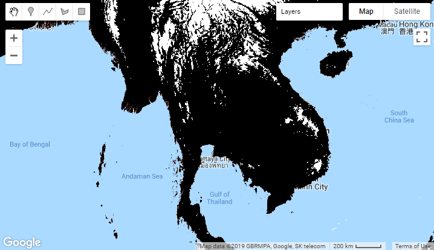

# Basics of Google Earth Engine (GEE)

First, sign in to GEE and go to https://code.earthengine.google.com/

## Accessing and Visualizing Images

Let’s try to access a single image first with SRTM Digital Elevation Model (DEM) dataset.

```javascript
var dem = ee.Image('CGIAR/SRTM90_V4'); 
print(dem)
```

_Note (Little bit information about SRTM): SRTM is Free Global Digital Elevation Models in 30m Spatial Resolution. The SRTM was produced from 11-day mission of the Space Shuttle Endeavour in February 2000 with modified radar system. You can download SRTM Data from http://srtm.csi.cgiar.org/srtmdata/_

Then, let’s try to visualize SRTM image in the map viewer. And add more colors to have meaningful visualization.

```javascript
var dem = ee.Image('CGIAR/SRTM90_V4');
print(dem)

var elevation = dem.select('elevation'); 

Map.setCenter(101.1412, 15.008, 5);
// Highest point in Thailand is 2565 m, so let's choose that as maximum value of visualization
Map.addLayer(elevation, {min: 0, max: 2565}, 'DEM');

Map.addLayer(elevation, {min: 0, max: 2565, 
	palette: ['brown', 'green']}, 'Elevation');

```


## Mathematical Operations with Images

First, let’s try simple mathematical operations by classifying elevation higher than 1000 m in to one class and rest in to another class.

```javascript
var elevationMask = elevation.gt(1000);

Map.setCenter(101.1412, 15.008, 5);
Map.addLayer(elevationMask, {min: 0, max: 1}, 'Mask');
```



_Exercise 1: Divide elevation image in to 3 classes as below and visualize it._
_* < 500 m : class 1_
_* Between 500 and 1500 m : class 2_
_* > 1500 m : class 3_

_Exercise 2: Search for a population data source in GEE and visualize it. Then classify it into 2 classes of your choice and visualize it._

## Exporting Images from GEE

Let’s export over elevation masked images to Google Drive.

```javascript
var studyArea = ee.Geometry.Rectangle(99.14, 17.34, 100.55, 18.47);

Export.image.toDrive({
	image: elevationMask,
	description: 'SRTM_Masked',
	scale: 100,
	region: studyArea
});
```

After running this code, go to "Tasks" tab and Click Run to start export in to Google Drive. After export, you can download from Google Drive and open in GIS software and go ahead with other analysis.

## Working with Image Collections

In most cases, we have to work with set of images rather than a single image. As an example, images from a sensor in a satellite, time series climate data, etc. are available as set of images. These are referred as Image Collection in GEE. In most cases, Image Collection is a stack or time series of images.

First let’s try with Image Collection of famous satellite Landsat 8 from US. Additionally, in this case, we filter it by location, date and sort by cloud coverage.

```javascript
var studyArea = ee.Geometry.Rectangle(103.66, 12.39, 104.64, 13.28);

var lst8Col = ee.ImageCollection('LANDSAT/LC08/C01/T1_SR')
	.filterDate('2018-09-01', '2018-10-31')
	.filterBounds(studyArea)
	.sort('CLOUD_COVER');

print(lst8Col)
```

_Note (Little bit information about Landsat 8): The Landsat program is the longest-running satellite imagery acquisition program of Earth starting from July 23, 1972. Landsat 8 is the most recent Satellite in the series launched on 11 February 2013. Spatial resolution is 30m and revisit time is 16 Days. You can download SRTM Data from http://earthexplorer.usgs.gov/_

