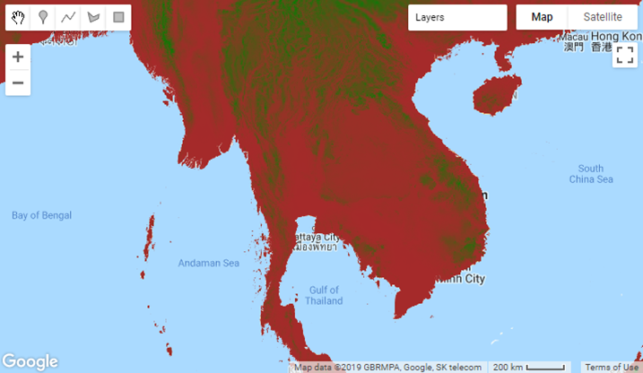
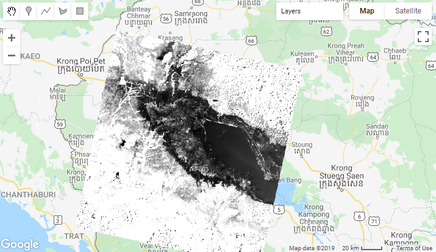
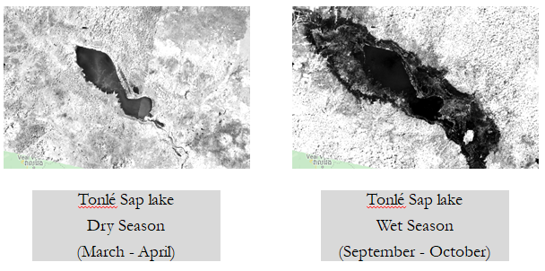
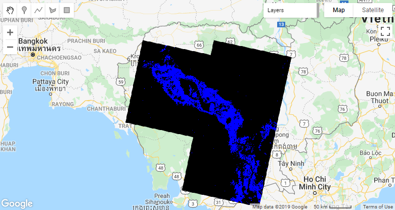
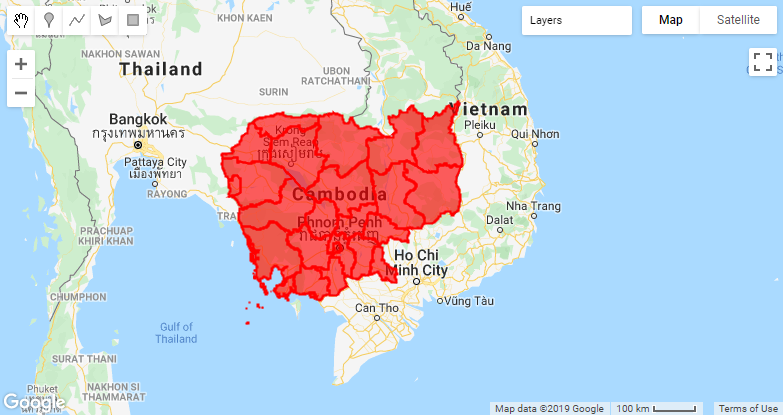
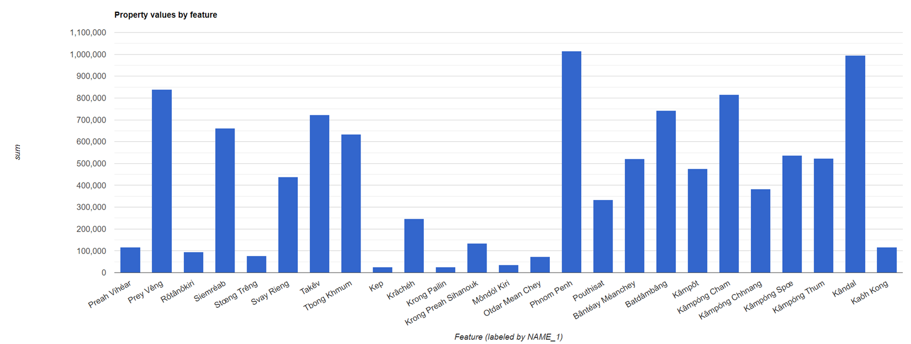

# zAppendix 1: Short Notes for Using Google Earth Engine (GEE) with JavaScript (Optional)

We can use 2 main languages (Python and JavaScript) to work with GEE. This section includes some short notes on how to use JavaScript to work with GEE. Content is almost identical to Python content. And this is an optional section.

GEE provide in-built code editor to work with GEE JavaScript. So First, let's sign in to GEE and go to https://code.earthengine.google.com/

__Content__

- (1) Accessing and Visualizing Images
- (2) Mathematical Operations with Images
- (3) Exporting Images from GEE
- (4) Working with Image Collections
- (5) Case Study – Analyzing change of Water Extent
- (6) Working with Vector Data
- (7) Working with Charts
- (8) Additional Stuff (Mosaicking and Mapping)

## 1) Accessing and Visualizing Images

Let’s try to access a single image first with SRTM Digital Elevation Model (DEM) dataset.

```javascript
var dem = ee.Image('CGIAR/SRTM90_V4'); 
print(dem)
```

_Note (Little bit information about SRTM): SRTM is Free Global Digital Elevation Models in 30m Spatial Resolution. The SRTM was produced from 11-day mission of the Space Shuttle Endeavour in February 2000 with modified radar system. You can download SRTM Data from http://srtm.csi.cgiar.org/srtmdata/_

Then, let’s try to visualize SRTM image in the map viewer. And add more colors to have meaningful visualization.

```javascript
var dem = ee.Image('CGIAR/SRTM90_V4');
print(dem)

var elevation = dem.select('elevation'); 

Map.setCenter(101.1412, 15.008, 5);
// Highest point in Thailand is 2565 m, so let's choose that as maximum value of visualization
Map.addLayer(elevation, {min: 0, max: 2565}, 'DEM');

Map.addLayer(elevation, {min: 0, max: 2565, 
	palette: ['brown', 'green']}, 'Elevation');

```


## 2) Mathematical Operations with Images

First, let’s try simple mathematical operations by classifying elevation higher than 1000 m in to one class and rest in to another class.

```javascript
var elevationMask = elevation.gt(1000);

Map.setCenter(101.1412, 15.008, 5);
Map.addLayer(elevationMask, {min: 0, max: 1}, 'Mask');
```


_Exercise: Divide elevation image in to 3 classes as below and visualize it._
_* < 500 m : class 1_
_* Between 500 and 1500 m : class 2_
_* > 1500 m : class 3_

_Exercise: Search for a population data source in GEE and visualize it. Then classify it into 2 classes of your choice and visualize it._

## 3) Exporting Images from GEE

Let’s export over elevation masked images to Google Drive.

```javascript
var studyArea = ee.Geometry.Rectangle(99.14, 17.34, 100.55, 18.47);

Export.image.toDrive({
	image: elevationMask,
	description: 'SRTM_Masked',
	scale: 100,
	region: studyArea
});
```

After running this code, go to "Tasks" tab and Click Run to start export in to Google Drive. After export, you can download from Google Drive and open in GIS software and go ahead with other analysis.

## 4) Working with Image Collections

In most cases, we have to work with set of images rather than a single image. As an example, images from a sensor in a satellite, time series climate data, etc. are available as set of images. These are referred as Image Collection in GEE. In most cases, Image Collection is a stack or time series of images.

First let’s try with Image Collection of famous satellite Landsat 8 from US. Additionally, in this case, we filter it by location, date and sort by cloud coverage.

```javascript
var studyArea = ee.Geometry.Rectangle(103.66, 12.39, 104.64, 13.28);

var lst8Col = ee.ImageCollection('LANDSAT/LC08/C01/T1_SR')
	.filterDate('2018-09-01', '2018-10-31')
	.filterBounds(studyArea)
	.sort('CLOUD_COVER');

print(lst8Col)
```

_Note (Little bit information about Landsat 8): The Landsat program is the longest-running satellite imagery acquisition program of Earth starting from July 23, 1972. Landsat 8 is the most recent Satellite in the series launched on 11 February 2013. Spatial resolution is 30m and revisit time is 16 Days. You can download SRTM Data from http://earthexplorer.usgs.gov/_

Now let’s visualize Landsat 8 image from the Collection with least cloud content as RGB image.

```javascript
print(lst8Col.first())

var visParams = {
	bands: ['B4', 'B3', 'B2'],
	min: 0,
	max: 3000
}; 

Map.setCenter(104.2, 12.9, 5);
Map.addLayer(lst8Col.first(), visParams);
```


Now let’s visualize image with Near Infrared (NIR) band which is suitable to distinguish water and land, as well as sensitive to vegetation content.

```javascript
var visParams = {
	bands: 'B5',
	min: 0,
	max: 3000
}; 

Map.setCenter(104.2, 12.9, 5);
Map.addLayer(lst8Col.first(), visParams);
```



_Exercise: Try more False Color Composites (specially 7-5-3 band) Images emphasizing more on different land cover types. For more information about False Color Composites refer to https://www.harrisgeospatial.com/Learn/Blogs/Blog-Details/ArtMID/10198/ArticleID/15691/The-Many-Band-Combinations-of-Landsat-8_

Now, let’s use mathematical operations between bands (Band Math) to calculate NDVI (Normalized Difference Vegetation Index) which indicated vegetation level.

```javascript
var image = lst8Col.first();

var ndvi = image.expression(
	'(NIR-RED)/(NIR+RED)',
	{'NIR': image.select('B5'), 'RED': image.select('B4')}
);

Map.setCenter(104.2, 12.9, 15);
Map.addLayer(ndvi, {min: -1, max: 1, palette: ['yellow', 'green']}, 'NDVI');
```


_Exercise: Use following expression to calculate Enhanced Vegetation Index (EVI) which is another vegetation index and compare with NDVI.
\2.5 * ((NIR - RED) / (NIR + 6 * RED - 7.5 * BLUE + 1))_

_Exercise: As we do early, use simple threshold to detect flood water from Near Infrared (NIR) Band. Tip: use expression similar to - nir.gt(1000)_

## 5) Case Study – Analyzing change of Water Extent

In this section, we will do flood mapping case study in Tonlé Sap lake in Cambodia. We will use Landsat 8 images in wet and dry season to sea change of water extent of the lake. And meanwhile we will learn more concepts, tools in GEE, such as Reduction over Image Collections, more on mathematical operations, etc.



Let’s first define two image collections for Wet and Dry Seasons in Cambodia.

```javascript
var studyArea = ee.Geometry.Rectangle(103.66, 12.39, 104.64, 13.28);

var wetSeason = ee.ImageCollection('LANDSAT/LC08/C01/T1_SR') 	.filterDate('2018-09-01', '2018-10-30')
	.filterBounds(studyArea)

var drySeason = ee.ImageCollection('LANDSAT/LC08/C01/T1_SR') 	.filterDate('2018-03-01', '2018-04-30')
	.filterBounds(studyArea)
```

Since wet and dry both image collections contains many images, we can use some time series analysis to reduce image collection to one image. Since water pixels are the dark pixels (less pixel value), if we have time series minimum, we will get maximum water extent in the wet and dry both seasons. In some references, this is called as cell statistics. And it’s powerful technique that can be used to reduce set of images to single image.

Now, let’s use reduction over wet and dry image collection to get maximum water extent of the lake in wet and dry seasons.

```javascript
var wetSeasonMin = wetSeason.min();
var drySeasonMin = drySeason.min();

var visParams = { bands: 'B5', min: 0, max: 3000}; 

Map.setCenter(104.2, 12.9, 8);

Map.addLayer(wetSeasonMin, visParams, 'WetSeason'); Map.addLayer(drySeasonMin, visParams, 'DrySeason');
```

Then, let’s stack NIR bands of wet and dry season images to create new image first. This is also knows as compositing bands. 

```javascript
var imageFCC = ee.Image([
	wetSeasonMin.select(['B5'], ['B_wet']), 	drySeasonMin.select(['B5'], ['B_dry'])
])

print(imageFCC)
```

Now let’s use newly created image to visualize flooded area as false color composite image. Flooded area will be in red color.

```javascript
var visParams = {
	bands: ['B_dry', 'B_wet', 'B_wet'],
	min: 0,
	max: 3000
};

Map.setCenter(104.2, 12.9, 5);
Map.addLayer(imageFCC, visParams);
```


Since water areas have dark pixels (less value), let’s try use threshold to extract water extent in dry and wet both seasons as we did very early with elevation data.

```javascript
var wetSeasonWater = wetSeasonMin.select('B5').lt(1000);
var drySeasonWater = drySeasonMin.select('B5').lt(1000);

var visParams = {min: 0, max: 1, palette: ['black', 'blue'] };

Map.setCenter(104.2, 12.9, 8);
Map.addLayer(wetSeasonWater, visParams, 'WetSeasonWater');
Map.addLayer(drySeasonWater, visParams, 'DrySeasonWater');
```

Extra water (flood water) in wet season are the water which was absent in the dry season and present in the wet season. This can be extracted using Boolean math operation as below,

```javascript
var flooosWater = wetSeasonWater.eq(1).and(drySeasonWater.eq(0)) 

var visParams = { min: 0, max: 1, palette: ['black', 'blue'] };

Map.setCenter(104.2, 12.9, 8);
Map.addLayer(flooosWater, visParams, 'Flood');
```



_Note (Optional step): We can see there are small patches detected as flood water which is not correct. We can use simple technique call focal minimum filter to remove those patches and smooth out the results as below._

```javascript
var flooosWaterFlt = flooosWater.focal_min(1, 'circle');

var visParams = { min: 0, max: 1, palette: ['black', 'blue'] };

Map.setCenter(104.2, 12.9, 8);
Map.addLayer(flooosWater, visParams, 'Flood');
Map.addLayer(flooosWaterFlt, visParams, 'FloodFlt');
```

**Finally Let’s Bring All Together**

```javascript
var studyArea = ee.Geometry.Rectangle(103.66, 12.39, 104.64, 13.28);

var wetSeason = ee.ImageCollection('LANDSAT/LC08/C01/T1_SR')
	.filterDate('2018-09-01', '2018-10-30')
	.filterBounds(studyArea);
var drySeason = ee.ImageCollection('LANDSAT/LC08/C01/T1_SR')
	.filterDate('2018-03-01', '2018-04-30')
	.filterBounds(studyArea);

var wetSeasonMin = wetSeason.min();
var drySeasonMin = drySeason.min();

var wetSeasonWater = wetSeasonMin.select('B5').lt(1000);
var drySeasonWater = drySeasonMin.select('B5').lt(1000); 

var flooosWater = wetSeasonWater.eq(1).and(drySeasonWater.eq(0))

var flooosWaterFlt = flooosWater.focal_min(1, 'circle');

var visParams = { min: 0, max: 1, palette: ['black', 'blue'] };
Map.setCenter(104.2, 12.9, 8);
Map.addLayer(flooosWaterFlt, visParams, 'FloodFlt');
```

## Working with Vector Data

We can add our data (in this case Shapefile of administrative boundary of Cambodia) to GEE with following steps.
* Click on "Assets"
* Click on "New" and select "Shape files"
* Select KHM_adm shapefile in ZIP format (located in "data" folder)
* Click on "Upload"
* After that, uploaded KHM_adm shapefile can be seen in "Assets" section

Now let’s visualize uploaded shapefile of Cambodia administrative boundary units in GEE which is similar to image visualization that we did early. 

```javascript
var KHMAdm = ee.FeatureCollection("users/lakmal/KHM_adm"); 

Map.setCenter(104.2, 12.9, 8); 

Map.addLayer(KHMAdm, {color: 'red'}, 'KHM Admin');
print(KHMAdm)
```



## Working with Charts

In this section, we will try to plot population of each province in Cambodia as a bar chart. So let’s first bring some population data which currently available in GEE and visualize it.

```javascript
var dataset = 
ee.ImageCollection("CIESIN/GPWv411/GPW_UNWPP-Adjusted_Population_Count").first();

var population = dataset.select('unwpp-adjusted_population_count');

print(population);

var visParams = { "min": 0.0, "max": 1000.0, "palette": ['yellow', 'red'], }; 
Map.setCenter(104.2, 12.9, 8);
Map.addLayer(population, visParams, ‘Population');
```

Now, let’s plot population of each province as bar chart.

```javascript
// This will cumulate population in each province 
var popByProvince = population.reduceRegions({
	collection: KHMAdm,
	reducer: ee.Reducer.sum(),
	scale: 1000,
});
print(popByProvince);

var chart = ui.Chart.feature.byFeature(popByProvince, 'NAME_1', 'sum').setChartType('ColumnChart')
print(chart);
```

**Let’s Bring All Together Again**

```javascript
var KHMAdm = ee.FeatureCollection("users/lakmal/KHM_adm");

var dataset = 
ee.ImageCollection("CIESIN/GPWv411/GPW_UNWPP-Adjusted_Population_Count").first();

var population = dataset.select('unwpp-adjusted_population_count');

var popByProvince = population.reduceRegions({
	collection: KHMAdm,
	reducer: ee.Reducer.sum(),
	scale: 1000,
});

var chart = ui.Chart.feature.byFeature(popByProvince, 'NAME_1', 'sum').setChartType('ColumnChart')
print(chart);
```



## Additional Stuff (Mosaicking and Mapping)

**Mosaicking**

Mosaicking refers to the process of spatially assembling image datasets to produce a spatially continuous image.

```javascript
var studyArea = ee.Geometry.Rectangle(103.66, 12.39, 104.64, 13.28); 

var drySeason = ee.ImageCollection('LANDSAT/LC08/C01/T1_SR')
	.filterDate('2018-03-11', '2018-03-13')
	.filterBounds(studyArea)

print(drySeason)

var mosaicDrySeason = drySeason.mosaic()

print(mosaicDrySeason)

var visParams = { bands: ['B4', 'B3', 'B2'], min: 0, max: 3000 }
Map.setCenter(104.2, 12.9, 5)
Map.addLayer(mosaicDrySeason, visParams);
```

**Mapping over Image Collection**

Mapping can be used to perform a operation over all images in an image collection.

```javascript
var studyArea = ee.Geometry.Rectangle(103.66, 12.39, 104.64, 13.28)

var drySeason = ee.ImageCollection('LANDSAT/LC08/C01/T1_SR')
	.filterDate('2018-03-11', '2018-03-13')
	.filterBounds(studyArea)

var waterDetection = function(image) {
	return image.select('B5').lt(1000)
}

var drySeasonWater = drySeason.map(waterDetection)

print(drySeasonWater)
```

_Exercise: Use above case study of Water Extent change of Tonlé Sap Lake to calculate province wise flooded area and plot province wise flooded area as bar chart. And use a population layer in GEE and calculate province wise population under flooded area  and plot it as bar chart._
